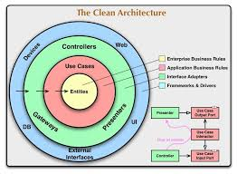

#go-project-layout

# 项目目录结构
[参考](https://github.com/golang-standards/project-layout/blob/master/README_zh.md)

# 项目构建
```shell
# 执行 make build ,会自动生产run目录，该目录是服务运行所需的文件
make build
cd run && docker-compose up -d

```
# 目录与架构说明
- 架构
```text
项目架构是基于领域驱动的Clean Architecture实现的
```


- 目录
```text
├── api     接口层
│   └── v1  v1版本
│       ├── ctrl 控制器
│       ├── middleware 中间件
│       └── route 路由入口
├── bin 编译输出的二进制文件目录
├── cmd 程序入口
├── config 配置文件目录
│   └── locales 多语言配置文件目录
├── docs 文档目录
├── internal 项目内部代码
│   ├── bootstrap 程序启动、初始化
│   ├── domain 实体领域目录
│   │   ├── request 请求结构体目录
│   │   ├── response 返回结构体目录
│   │   └── types 实体自定义类型目录
│   ├── infra 基础组件目录
│   │   └── cache 缓存目录
│   ├── repository 存储库目录
│   └── usecase 用例目录，编写业务逻辑
├── pkg 项目本身依赖
│   ├── scontext 上下文自定义目录
│   ├── serror 错误自定义目录
│   └── sslog 日子自定义目录
├── resource 静态资源目录
└── scripts 可执行脚本目录
```
